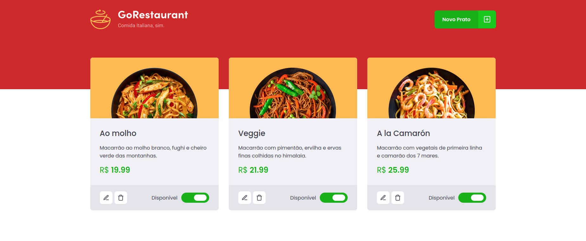
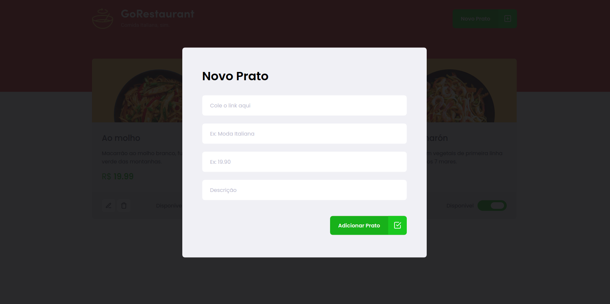
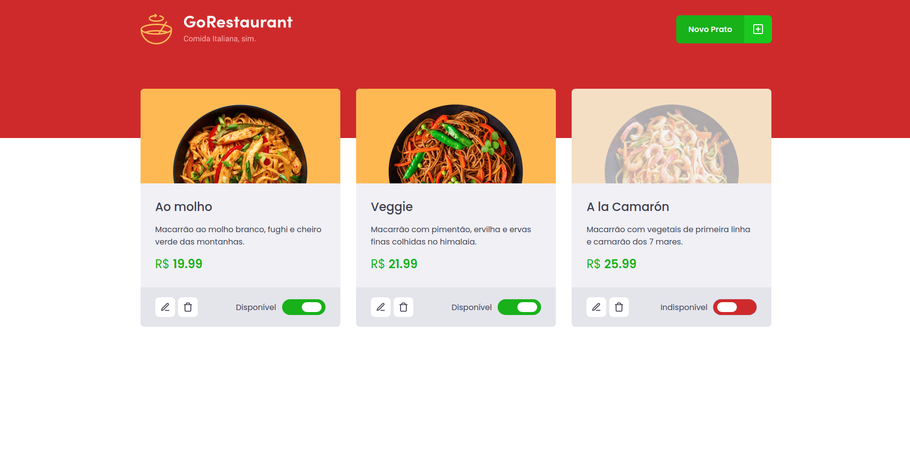

## GoRestauranteWeb Desafio10

<h1 align="center">
  <p align="center">
    
  </p>

  <h3 align="center">
    Uma aplicação de um restaurante, onde pode acrescentar ou retirar pratos do seu cardápio 🍕☕🥓🍔🍜🥘🍝
  </h3>
  <p align="center">
      
      
      
      
  </p>
</h1>

<p align="center">
  <a href="#page_with_curl-sobre">Sobre</a>&nbsp;&nbsp;&nbsp;|&nbsp;&nbsp;&nbsp;
  <a href="#books-requisitos">Requisitos</a>&nbsp;&nbsp;&nbsp;|&nbsp;&nbsp;&nbsp;
  <a href="#rocket-começando">Começando</a>&nbsp;&nbsp;&nbsp;|&nbsp;&nbsp;&nbsp;
  <a href="#gear-iniciando-back-end">Node.js</a>&nbsp;&nbsp;&nbsp;|&nbsp;&nbsp;&nbsp;
</p>

## :page_with_curl: Sobre
GoRestaurante é uma aplicação criada a partir do treinamento imersivo GoStack13 para criar um cardápio mostrando ou retirando os pratos.

Nela o usuário tem acesso aos seus pratos, podendo escolher outro para acrescentar no seu cardápio.

Nesse projeto tive como principal objetivo aprender a consumir uma API fake e estudar toda a documentação por trás dela, aplicando meus conhecimentos em ReactJS até o momento.

**Node.js**: realiza todas as chamadas a API e customizamos as respostas pra serem da forma que tem que ser. Serve todos os dados para o front-end.

**ReactJS**: é uma página Web no qual o usuário terá acesso a apçlicação.

## :books: Requisitos
- Ter [**Git**](https://git-scm.com/) para clonar o projeto.
- Ter [**Node.js**](https://nodejs.org/en/) instalado.
- Ter [**Yarn**](https://classic.yarnpkg.com/pt-BR/docs/install/) instalado.

## :rocket: 🎧🕹Começando
``` bash
  # Clonar o projeto:
  $ git clone https://github.com/Gilles30/GoRestaurante-desafio10

  # Entrar no diretório:
  $ cd GoRestaurante-desafio10
```

## :gear: Iniciando back-end 
```bash
  # Executar o servidor:
  $ yarn json-server server.json -p 3333

  # Instalar as dependências:
  $ yarn

  # Rodar a aplicação:
  $ yarn start
```
:computer: 

## Preview

<p size=3>
  
</p>

<p size=3>
  
</p>

<p size=3>
  
</p>


Feito com 💜 por [Lorison Gilles](https://github.com/Gilles30) 🖖🏻👾☕
